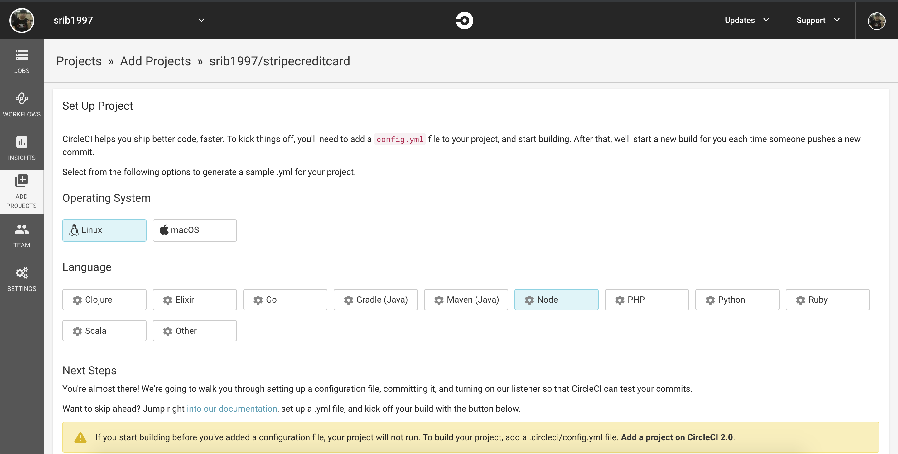
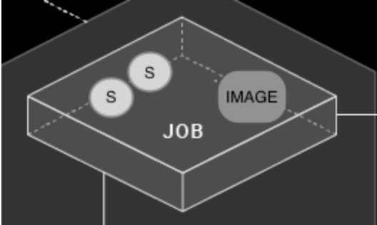
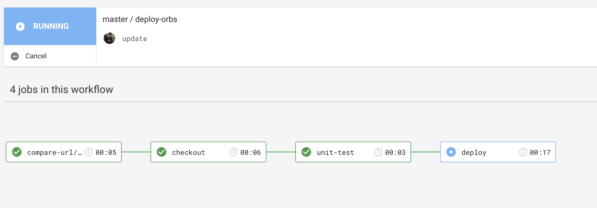
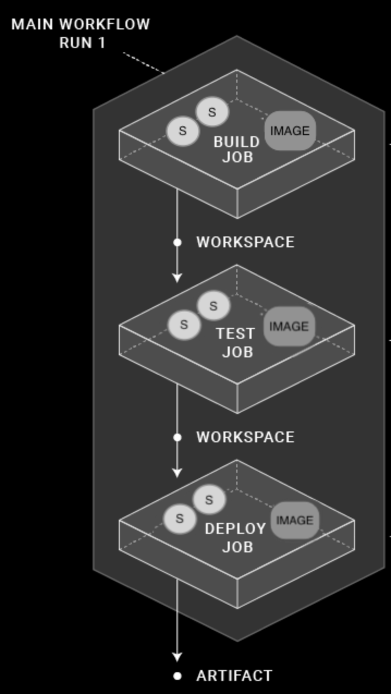

首先在自己的 probject 的根目錄，建立一個 **.circleci** floder，然後新增一個叫 **config.yml** file 在剛剛的 floder 之下

```yml
version: 2 # use CircleCI 2.0(用 CircleCI 2.0)
jobs: # a collection of steps(一系列步驟)
  build: # runs not using Workflows must have a `build` job as entry point（運行不使用 Workflows 必須有一個 `build` 作為入口點）
    working_directory: ~/mern-starter # directory where steps will run （ 將要運行步驟的目錄 ）
    docker: # run the steps with Docker （ 使用Docker運行步驟 ）
      - image: circleci/node:4.8.2 # ...with this image as the primary container; this is where all `steps` will run （ 將此 image 作為主要容器; 這是所有“步驟”將運行的地方 ）
      - image: mongo:3.4.4 # and this image as the secondary service container (並且此 image 作為輔助服務容器)
    steps: # a collection of executable commands ( 可執行命令的集合 )
      - checkout # special step to check out source code to working directory ( 檢查源代碼到工作目錄的特殊步驟 )
      - run:
          name: update-npm
          command: 'sudo npm install -g npm@latest'
      - restore_cache: # special step to restore the dependency cache ( 恢復依賴項緩存的特殊步驟 )
          # Read about caching dependencies: https://circleci.com/docs/2.0/caching/
          # 閱讀有關緩存依賴項的信息
          key: dependency-cache-{{ checksum "package.json" }}
      - run:
          name: install-npm-wee
          command: npm install
      - save_cache: # special step to save the dependency cache
          key: dependency-cache-{{ checksum "package.json" }}
          paths:
            - ./node_modules
      - run: # run tests
          name: test
          command: npm test
      - run: # run coverage report
          name: code-coverage
          command: './node_modules/.bin/nyc report --reporter=text-lcov'
      - store_artifacts: # special step to save test results as as artifact 
          # Upload test summary for display in Artifacts: https://circleci.com/docs/2.0/artifacts/ 
          path: test-results.xml
          prefix: tests
      - store_artifacts: # for display in Artifacts: https://circleci.com/docs/2.0/artifacts/ 
          path: coverage
          prefix: coverage
      - store_test_results: # for display in Test Summary: https://circleci.com/docs/2.0/collect-test-data/
          path: test-results.xml
      # See https://circleci.com/docs/2.0/deployment-integrations/ for deploy examples
```

---
???不明白，正常，我也不明白，怎會有人一開始就明白呢？這個官方的 quick start 看得我一頭汗

接下來才是正式開始
---

# orbs(球體)

orbs 介紹
CircleCI Orbs是配置元素的可共享包，包括作業，命令和執行程序。 CircleCI提供經認證的 orbs，以及由CircleCI合作夥伴撰寫的第三方 orbs。 
最佳做法是首先評估這些現有的orbs是否會在配置工作流程中為您提供幫助。 有關認證球體的完整列表，請參閱 [CircleCI Orbs](https://circleci.com/orbs/registry/)註冊表。

導入現有球體
要導入現有的 orb，請為每個orb的2.1 .circleci / config.yml文件添加，例如：

```
version: 2.1

orbs:
    hello: circleci/hello-build@0.0.7 # 使用circleci / buildpack-deps Docker鏡像

workflows:
    "Hello Workflow":
        jobs:
          - hello/hello-build
```

然後就可以在 circleCi 的 add probject 加自已的 probject 就可以了。

這只是第一個測試，如果你覺得接受不了，就去看什麼懶人包，我也和你一樣第一次接觸 circleCI ，我才學了半年的程式碼，我理解初學者的痛（如果我小的時候，有好好學英文就好了😂）

# Concepts(概念)

CircleCI 項目共享相關代碼存儲庫的名稱，並在 CircleCI app 的 Projects page 上可見。 使用 “Add Project” 按鈕添加 Projects 。

接下來會介紹5個大點
* Add Projects Page （添加項目頁面）
* Steps （步驟）
* Image （映像）
* Jobs （作業）
* Workflows （工作流程）

---

## 1. Add Projects Page （添加項目頁面）



用戶可以訂閱項目( Projects )狀態的電子郵件通知，並將項目添加到他們的 CircleCI 儀表板(dashboard)。

項目管理員( Project Administrator)是將 GitHub 或 Bitbucket 存儲庫(repository)作為項目添加到 CircleCI 的用戶。 用戶是組織(org)內的個人用戶。 CircleCI 用戶是指可以使用用戶名和密碼登錄 CircleCI 平台的任何人。 必須將用戶添加到 GitHub 或 Bitbucket 組織(org) 才能查看或關注相關的CircleCI項目。 用戶可能無法查看存儲在環境變量中的項目數據。

---

## 2. Steps （步驟）

步驟(steps)是執行工作(job)所需的操作。 步驟通常是可執行命令(command)的集合。 例如，checkout 步驟通過 SSH 檢出作業(job)的源代碼。 然後，run 步驟默認使用 non-login shell 執行 make test 命令。

```yml
#...
    steps:
      - checkout # Special step to checkout your source code
      - run: # Run step to execute commands, see
      # circleci.com/docs/2.0/configuration-reference/#run
          name: Running tests
          command: make test # executable command run in
          # non-login shell with /bin/bash -eo pipefail option
          # by default.
#...          
```

---

## 3. Image（映像）

映像是一個打包的系統(packaged system)，其中包含創建正在運行的容器的說明。 主容器由.circleci / config.yml文件中列出的第一個映像。 這是使用 Docker 程序為 jobs 執行 commands 的地方。

```yml
 version 2
 jobs:
   build1: # job name
     docker: # Specifies the primary container image,
     # see circleci.com/docs/2.0/circleci-images/ for
     # the list of pre-built CircleCI images on dockerhub.
       - image: buildpack-deps:trusty

       - image: postgres:9.4.1 # Specifies the database image
        # for the secondary or service container run in a common
        # network where ports exposed on the primary container are
        # available on localhost.
         environment: # Specifies the POSTGRES_USER authentication
          # environment variable, see circleci.com/docs/2.0/env-vars/
          # for instructions about using environment variables.
           POSTGRES_USER: root
...
   build2:
     machine: # Specifies a machine image that uses
     # an Ubuntu version 14.04 image with Docker 17.06.1-ce
     # and docker-compose 1.14.0, follow CircleCI Discuss Announcements
     # for new image releases.
       image: circleci/classic:201708-01
...       
   build3:
     macos: # Specifies a macOS virtual machine with Xcode version 9.0
       xcode: "9.0"       
 ...          

```

---

## 4. Jobs （作業）

作業(jobs)是一組步驟(steps)，每個作業(job)必須聲明一個執行者(executor: docker，machine或macos)。 機器 Machine 默認image （如果未指定），對於Docker和macOS，您還必須聲明 image。



### cache （緩存）

緩存存儲中的存儲文件或文件目錄，例如依賴項或源代碼。 每個作業(job)可能包含特殊步驟(special steps)，用於緩存先前作業(job)的依賴關係以加速構建。

```yml
version: 2
jobs:
  build1:
    docker: # Each job requires specifying an executor(每項工作都需要指定執行者)
    # (either docker, macos, or machine), see
    # circleci.com/docs/2.0/executor-types/ for a comparison
    # and more examples.
      - image: circleci/ruby:2.4-node
      - image: circleci/postgres:9.4.12-alpine
    steps:
      - checkout
      - save_cache: # Caches dependencies with a cache key(使用緩存鍵緩存依賴項)
      # template for an environment variable,
      # see circleci.com/docs/2.0/caching/
          key: v1-repo-{{ .Environment.CIRCLE_SHA1 }}
          paths:
            - ~/circleci-demo-workflows

  build2:
    docker:
      - image: circleci/ruby:2.4-node
      - image: circleci/postgres:9.4.12-alpine
    steps:
      - restore_cache: # Restores the cached dependency.(恢復緩存的依賴項。)
          key: v1-repo-{{ .Environment.CIRCLE_SHA1 }}       
```

---

## 5. Workflows （工作流程）

工作流程（Workflows）定義作業列表(list of jobs)及其運行順序。 可以使用作業並行(平行線上，不明白看圖)，按順序，按計劃或使用手動作業（job)。



```yml
version: 2
jobs:
  build1:
    docker:
      - image: circleci/ruby:2.4-node
      - image: circleci/postgres:9.4.12-alpine
    steps:
      - checkout
      - save_cache: # Caches dependencies with a cache key
          key: v1-repo-{{ .Environment.CIRCLE_SHA1 }}
          paths:
            - ~/circleci-demo-workflows
      
  build2:
    docker:
      - image: circleci/ruby:2.4-node
      - image: circleci/postgres:9.4.12-alpine
    steps:
      - restore_cache: # Restores the cached dependency.
          key: v1-repo-{{ .Environment.CIRCLE_SHA1 }}
      - run:
          name: Running tests
          command: make test
  build3:
    docker:
      - image: circleci/ruby:2.4-node
      - image: circleci/postgres:9.4.12-alpine
    steps:
      - restore_cache: # Restores the cached dependency.
          key: v1-repo-{{ .Environment.CIRCLE_SHA1 }}
      - run:
          name: Precompile assets
          command: bundle exec rake assets:precompile
...                          
workflows:
  version: 2
  build_and_test: # name of your workflow
    jobs:
      - build1
      - build2:
        requires:
           - build1 # wait for build1 job to complete successfully before starting (開始前等待 build1 job 成功)
           # see circleci.com/docs/2.0/workflows/ for more examples.
      - build3:
        requires:
           - build1 # wait for build1 job to complete successfully before starting (開始前等待 build1 job 成功)
           # run build2 and build3 in parallel to save time.

```

Workspaces and Artifacts（工作區和工件）

工作區是一種工作流程感知存儲機制（workflows-aware storage mechanism）。 工作空間存儲（workspace stores）作業（job)唯一的數據(data)，這可能是下游(downstream )作業(job)中需要的。 工作流完成後，工件會保留數據，並可用於長期存儲輸出構建過程輸出。

每個工作流都有一個與之關聯的臨時工作區。 工作區可用於將作業期間構建的唯一數據傳遞到同一工作流中的其他作業。



```yml
version: 2
jobs:
  build1:
...   
    steps:    
      - persist_to_workspace: # Persist the specified paths (workspace/echo-output)(保留指定的路徑（工作區/回顯輸出）)
      # into the workspace  for use in downstream job. Must be an absolute path,(進入工作空間以用於下游作業。 必須是一條絕對的path)
      # or relative path from working_directory. This is a directory on the container which is(或working_directory的相對路徑。 這是容器上的目錄)
      # taken to be the root directory of the workspace.(被視為工作區的根目錄)
          root: workspace
            # Must be relative path from root(必須是從root的相對路徑)
          paths:
            - echo-output

  build2:
...
    steps:
      - attach_workspace:
        # Must be absolute path or relative path from working_directory(必須是working_directory的絕對路徑或相對路徑)
          at: /tmp/workspace
  build3:
...
    steps:
      - store_artifacts: # See circleci.com/docs/2.0/artifacts/ for more details.
          path: /tmp/artifact-1
          destination: artifact-file
...
```

---

文章會持續更新，喜歡的話可以在瀏覽器將文章加入 bookmark