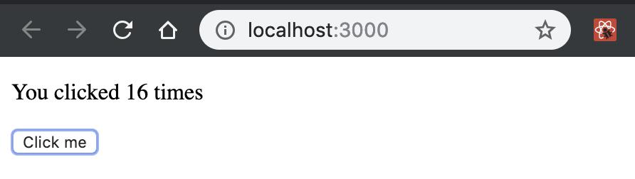
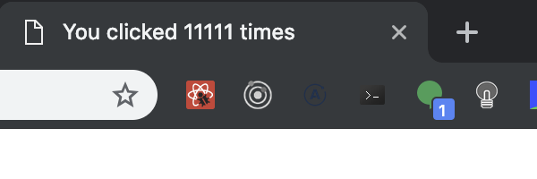

# React Hooks 

---

```js
import React, { useState } from 'react';

function Example() {
  // Declare a new state variable, which we'll call "count"
  // 聲明一個新的狀態變量，我們將其稱為 “count”
  const [count, setCount] = useState(0);

  return (
    <div>
      <p>You clicked {count} times</p>
      <button onClick={() => setCount(count + 1)}>
        Click me
      </button>
    </div>
  );
}
```

這個新函數 useState 是我們將要學習的第一個 “hook”，但這個例子只是一個測試。 如果它沒有意義，請不要擔心！

在這個頁面上，我們將繼續解釋為什麼我們將 Hook 添加到 React 以及它們如何幫助您編寫出色的應用程序。

---

```
注意

React 16.8.0是第一個支持Hooks的版本。 升級時，不要忘記更新所有包，包括React DOM。 

React Native將在下一個穩定版本中支持Hook。
```

---

視頻介紹

在React Conf 2018中，Sophie Alpert和Dan Abramov介紹了Hooks，隨後Ryan Florence演示瞭如何重構應用程序以使用它們。 

觀看視頻：

<iframe width="560" height="315" src="https://www.youtube.com/embed/dpw9EHDh2bM" frameborder="0" allow="accelerometer; autoplay; encrypted-media; gyroscope; picture-in-picture" allowfullscreen></iframe>

---

## 沒有重大變化

在我們繼續之前，請注意Hooks是：

**完全自己選擇加入**。 您可以在幾個 components 中嘗試 Hooks，而無需重寫任何現有代碼。 但是如果你不想，你現在不必學習或使用Hooks。

**100％向後兼容**。  Hook 不包含任何重大更改。

**現在可以使用**。 v16.8.0的發布，現在可以使用 Hook。

**沒有計劃從 React 中刪除 class**。 您可以在本頁底部閱讀有關 Hooks 逐步採用策略的更多信息。

**hook 不會取代你對 React 概念的了解**。 相反，Hooks為您已經知道的 React 概念提供了更直接的API：
props，state，context，refs和lifecycle。 
正如我們稍後將展示的那樣，Hooks 還提供了一種新的強大方式來組合它們。

您還可以繼續閱讀此頁面以了解有關我們添加Hooks的原因的更多信息，以及我們如何在不重寫應用程序的情況下開始使用它們。

---

## Motivation

Hook 解決了 React 中各種看似無關的問題，我們在編寫和維護數以萬計的組件( components )時遇到了這些問題。 無論您是在學習React，每天使用它，還是更喜歡使用具有相似組件模型(similar component model)的不同庫，您都可能會發現其中的一些問題。

1. It’s hard to reuse stateful logic between components (在組件之間重用狀態邏輯很困難)
2. Complex components become hard to understand (複雜的組件變得難以理解)
Hooks 允許您根據相關的部分（例如設置訂閱或獲取數據）將一個組件拆分為較小的函數，而不是基於生命週期方法強制拆分。
3. Classes confuse both people and machines ( classes 會混淆人和機器)
Hooks 允許您在沒有 class 的情況下使用更多 React 的功能

---

## Gradual Adoption Strategy (逐步採用策略)

TLDR：沒有計劃從React中刪除 class。

我們打算讓Hooks涵蓋所有現有的 class，但是在 react 不會放棄支持 class。在Facebook，我們有數以萬個組件用 class 編寫，我們絕對沒有計劃重寫它們。相反，我們開始在新代碼中使用 Hooks 與 class。

---

## 下一步

在本頁末尾，您應該大致了解Hook正在解決的問題，但很多細節可能都不清楚。 別擔心！ 現在讓我們將通過示例開始學習Hooks。

---

## State Hook

此示例呈現計數器。 單擊該按鈕時，它會遞增值：

```js
import React, { useState } from 'react';

function Example() {
  // Declare a new state variable, which we'll call "count"
  const [count, setCount] = useState(0);

  return (
    <div>
      <p>You clicked {count} times</p>
      <button onClick={() => setCount(count + 1)}>
        Click me
      </button>
    </div>
  );
}
```


Here, useState is a Hook (we’ll talk about what this means in a moment 稍後). We call it inside a function component to add some local state to it. React will preserve(保留
) this state between re-renders(重新渲染). useState returns a pair(一對): the current state value(當前狀態值) and a function that lets you update it. You can call this function from an event handler or somewhere else.( 您可以從事件處理程序或其他地方使用這個功能。) It’s similar to this.setState in a class, except it doesn’t merge the old and new state together. (只是它不合併新老狀態。)

useState的唯一參數是初始狀態。 在上面的例子中，它是0，因為我們的計數器從零開始。 請注意，與this.state不同，此處的狀態不必是 object - 儘可以是您想要。 初始狀態參數(initial state argument)僅在第一次渲染期間使用。

---

聲明多個 state變量

您可以在單個組件(component) 中多次使用State Hook：

```js
function ExampleWithManyStates() {
  // Declare multiple state variables!
  const [age, setAge] = useState(42);
  const [fruit, setFruit] = useState('banana');
  const [todos, setTodos] = useState([{ text: 'Learn Hooks' }]);
  // ...
}
```

數組解構語法(array destructuring syntax)允許我們為通過調用 useState 的狀態變量賦予不同的名稱。 這些名稱不是 useState API 的一部分。 相反，React假定如果多次調用useState，則在每次渲染期間以相同的順序執行。 之後你就會想為什麼這種方法有效，以及何時有用。

但是什麼是 hooks？

hooks是讓您從功能組件“hook into”React狀態和生命週期功能的功能。 hook 在 class內部不起作用 - 它們允許你在沒有 class 的情況下使用 React。

React提供了一些像useState這樣的內置Hook。 您還可以創建自己的Hook以重用不同組件之間的狀態行為。 我們先來看看內置的Hooks。

## Effect Hook

您之前可能已經從React組件執行 data fetching, subscriptions 或 manually (手動)更改DOM。 我們將這些操作稱為“side effects”（或簡稱為“effects”），因為它們會影響其他組件(components)，並且在渲染過程中無法完成。

Effect Hook，useEffect增加了從功能組件(function component)執行  side effects的功能。 它與React classes 中的componentDidMount，componentDidUpdate和componentWillUnmount具有相同的用途，但統一為單個API。

```js
import React, { useState, useEffect } from 'react';

function Example() {
  const [count, setCount222] = useState('');

  // Similar to componentDidMount and componentDidUpdate:
  useEffect(() => {
    // Update the document title using the browser API
    document.title = `You clicked ${count} times`;
  });

  return (
    <div>
      <p>You clicked {count} times</p>
      <button onClick={() => setCount222(count + 1)}>
        Click me
      </button>
    </div>
  );
}
export default Example
```



當你調用 useEffect 時，你告訴React在刷新對DOM的更改後運行你的“effect” function。 effects在 components 內聲明，因此可以訪問其props和state。 默認情況下，React在每次 render 後運行效果 - 包括第一次render 。 

effects 還可以選擇通過 returning a function 來指定如何“clean up”它們。 例如，此組件使用 effect 來訂閱朋友的在線狀態，並通過取消訂閱來清理：

```js
import React, { useState, useEffect } from 'react';

function FriendStatus(props) {
  const [isOnline, setIsOnline] = useState(null);

  function handleStatusChange(status) {
    setIsOnline(status.isOnline);
  }

  useEffect(() => {
    ChatAPI.subscribeToFriendStatus(props.friend.id, handleStatusChange);

    return () => {
      ChatAPI.unsubscribeFromFriendStatus(props.friend.id, handleStatusChange);
    };
  });

  if (isOnline === null) {
    return 'Loading...';
  }
  return isOnline ? 'Online' : 'Offline';
}
```

---
參考文章:

[Introducing Hooks](https://reactjs.org/docs/hooks-intro.html)